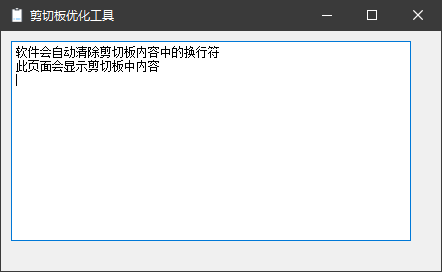

# ClipboardManager
> 一款剪切板自动管理小程序，监视剪切板并自动将剪切板中的换行符替换为空格，方便我翻译论文

> An automatic clipboard management applet that monitors the clipboard and automatically replaces line breaks in the clipboard with spaces, making it easy for me to translate my papers

使用python语言

依赖库：

* [pyperclip](https://pypi.org/project/pyperclip/)
* [PyQt5](https://pypi.org/project/PyQt5/)

* 自动清除剪切板中的换行符
* 配合[deepL](https://www.deepl.com/zh/translator)使用很方便😊

